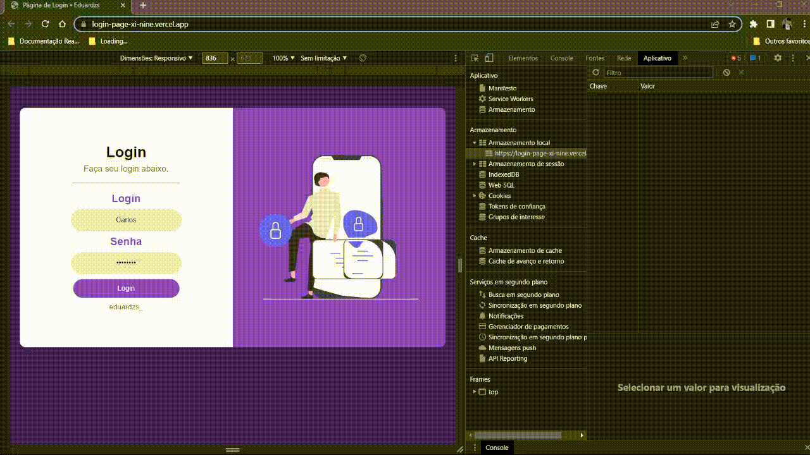
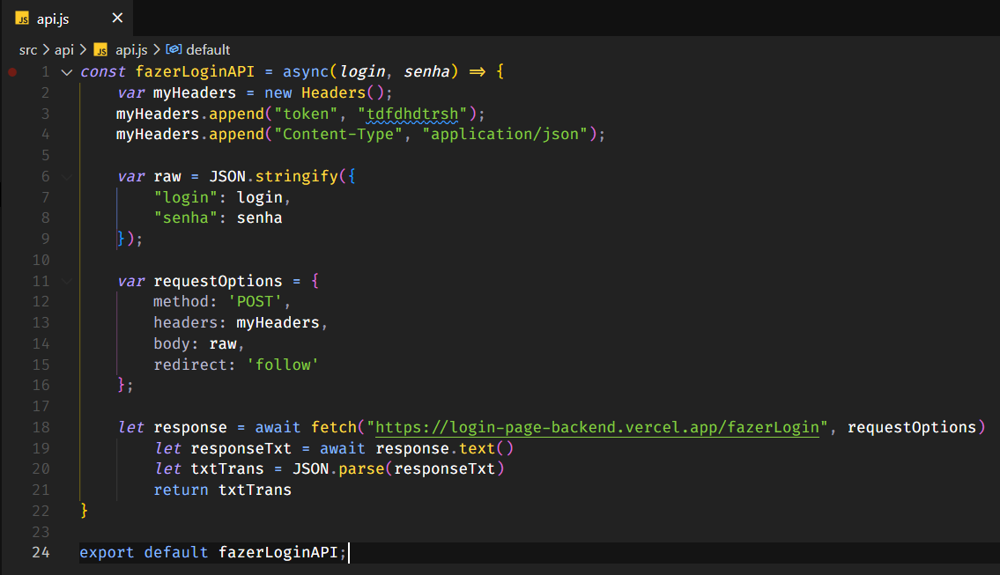
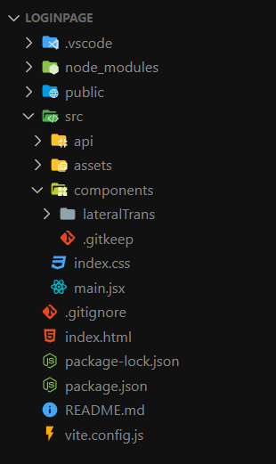
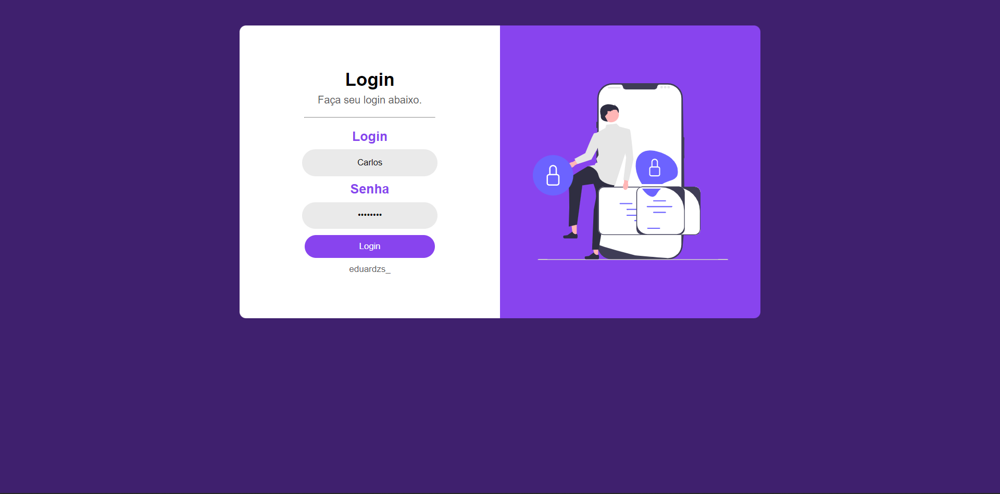
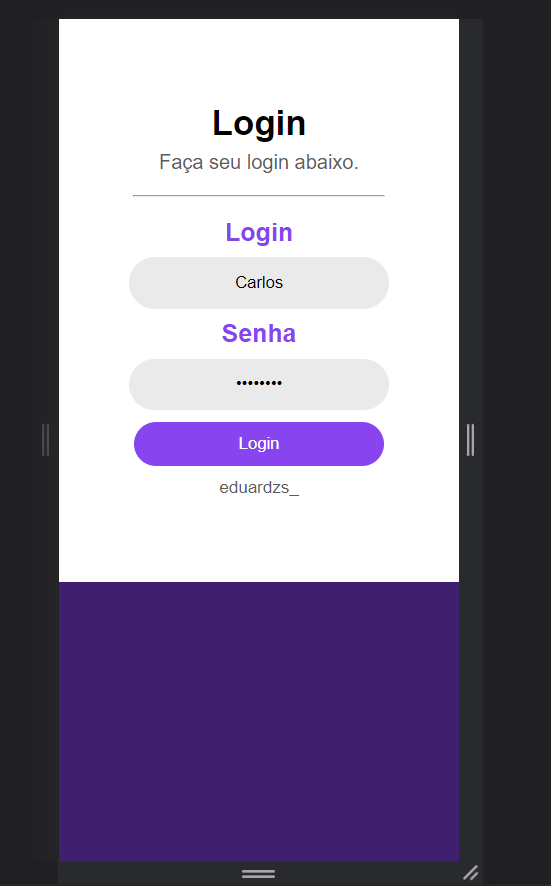
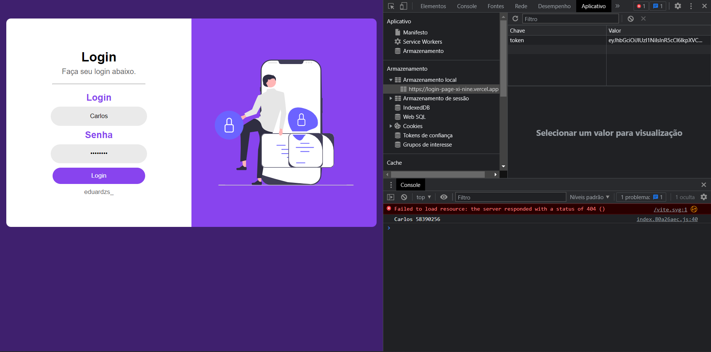

<h2>Frontend Login Page</h2>

      

<a href="https://login-page-xi-nine.vercel.app/" target=”_blank”>Link do Projeto</a>

Esse projeto foi feito visando a consolidação dos conhecimentos básicos de ReactJS e FETCH.

Para está construção foram usados os conceitos de states, props, components e stylesheet (flex e grid).

Utilizando o fatch para as chamadas http, o local storage para armazenamento de informação da sessão e vite para a criação do boilerplate.

      

Para a boilerplate foi utilizado o vitejs pois ele faz um uso melhor das tecnologias implementadas no navegador, como o esquema de módulos, possui muito menos arquivos na sua criação inicial do boilerplate. O que não gera o desconforto e a poluição visual que o seu antecessor "create-react-app" fazia.

      

<a href="https://login-page-xi-nine.vercel.app/" target=”_blank”>Link do Projeto</a>

    <h4>Designer do Frontend Web</h4>
    
    <h4>Designer do Frontend Mobile</h4>
    
    <h4>Token</h4>
    

